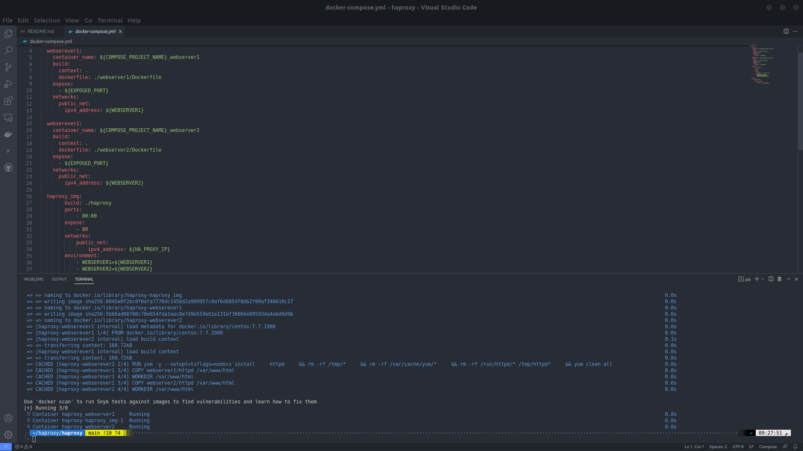

# haproxy pn Docker

### Context
This is a school assignment. Originally we're asked to do this using virtual machines. Due to the problems caused by virtual machines (Overheating, Network overlapping), I decided to go this way. Using Docker, it became easier to accomplish the assignment.

### Structure
---

```
├── README.md
├── .env
├── docker-compose.yml
├── webserver1
|  ├── Dockerfile
|  └── httpd
|       ├── index.html
|       └──  assets
|            └── css
|               ├── bootstrap.min.css
|               └── my-style.css
├── webserver2
|  ├── Dockerfile
|  └── httpd
|       ├── index.html
|       └──  assets
|            └── css
|               ├── bootstrap.min.css
|               └── my-style.css
└── haproxy
   ├── Dockerfile
   └── haproxy.cfg

```
---
### haproxy

HAProxy is a free and open source software that provides a high availability load balancer and reverse proxy for TCP and HTTP-based applications that spreads requests across multiple servers. It is written in C and has a reputation for being fast and efficient.

### haproxy on Docker
Docker containers bring considerable benefits, chief among them being less ceremony around installation and execution.
In terms of CPU overhead, it helps to remember that, unlike a virtual machine, Docker does not require a layer of virtualization on top of the host operating system. 


